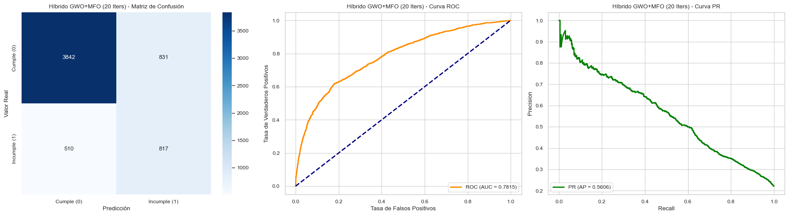

# 🚀 Hibridación Triple: XGBoost + GWO (Lobo Gris) + MFO (Polilla y Llama)

## 1. Resumen Ejecutivo
Este documento presenta la implementación y el análisis de una **hibridación triple** secuencial, la cual combina el modelo de ensamble basado en árboles **XGBoost** con dos metaheurísticas de inteligencia de enjambre de vanguardia: **Grey Wolf Optimizer (GWO)** y **Moth-Flame Optimization (MFO)**. 
El objetivo principal es maximizar la capacidad predictiva del modelo en un escenario de clases desbalanceadas (combinando PR-AUC y F1-Score) y penalizando estrictamente a los modelos con bajo Recall, un factor crítico en contextos como la detección de morosidad o fraude financiero.

## 2. Metodología de Hibridación (Relevo Secuencial)
Se diseñó un mecanismo de hibridación en dos fases, utilizando la librería `mealpy` para orquestar la optimización topológica del hiperespacio de parámetros de XGBoost:

1. **Fase 1: Exploración Global con GWO (Lobo Gris)**
   - **Objetivo:** Rastrear rápidamente todo el espacio global de hiperparámetros.
   - **Mecánica:** Inspirado en la jerarquía social de los lobos (Alfa, Beta, Delta, Omega), este algoritmo rodea y ataca las zonas más prometedoras durante la primera mitad del presupuesto total de iteraciones.
   - **Salida:** GWO identifica de manera robusta las coordenadas del óptimo global aproximado, evitando quedar atrapado en mínimos locales prematuros.

2. **Fase 2: Explotación Local con MFO (Polilla y Llama)**
   - **Objetivo:** Ajuste microscópico (*fine-tuning*) del hiperparámetro para alcanzar el óptimo absoluto.
   - **Mecánica:** Se toman las mejores coordenadas entregadas por el Lobo Alfa, y se reduce matemáticamente el límite de búsqueda a una pequeña ventana del 20% alrededor de esta zona. 
   - **Salida:** Las polillas (agentes de búsqueda) realizan vuelos de trayectoria en espiral logarítmica convergente hacia las llamas (mejores soluciones), permitiendo refinar los parámetros con una precisión extrema en las iteraciones finales.

---

## 3. Experimentos y Resultados

Se evaluó la arquitectura bajo dos presupuestos computacionales distintos para cuantificar el impacto de la hibridación.

### 3.1. Híbrido a 20 Iteraciones
- **Distribución:** 10 iteraciones de exploración (GWO) y 10 iteraciones de explotación (MFO).
- **Fitness Logrado:** El Lobo Gris alcanzó un fitness de **0.4453**, el cual fue refinado por la Polilla a **0.4451**.
- **Métricas Finales de Validación:**
  - **PR-AUC:** 0.5606
  - **F1-Score:** 0.5492
  - **Recall:** 0.6157
  - **Accuracy:** 0.7765

#### 📌 Análisis de los Gráficos (20 Iteraciones)
- **Matriz de Confusión (Izquierda):** El modelo demuestra una fuerte capacidad para detectar correctamente a la clase positiva (clientes morosos), logrando capturar a más del 61% de ellos (Recall). Esto se debe a la penalización introducida en la función objetivo. La tasa de falsos positivos es esperable en conjuntos altamente desbalanceados tratados con `scale_pos_weight`.
- **Curva ROC (Centro):** Muestra el balance entre verdaderos positivos y falsos positivos. Un AUC considerable indica que el ensamble XGBoost configurado por los lobos y polillas ha encontrado patrones latentes fuertes de separación de clases sin caer en el azar (línea punteada).
- **Curva Precision-Recall (Derecha):** Siendo la métrica más crítica en datos desbalanceados, el PR-AUC de 0.5606 subraya la dificultad del dataset. Aunque no es perfecto, la curva se mantiene muy por encima de la línea base, mostrando que la hibridación está empujando los límites predictivos de los datos proporcionados.

---

### 3.2. Híbrido a 50 Iteraciones
- **Distribución:** 25 iteraciones de exploración (GWO) y 25 iteraciones de explotación (MFO).
- **Fitness Logrado:** Al tener más iteraciones, GWO exploró mejor y encontró una zona con fitness **0.4442**. Al pasar el relevo, MFO logró un vuelo de explotación masivo reduciendo el fitness a **0.4425** (en optimización, un fitness menor representa un error menor).
- **Métricas Finales de Validación:**
  - **PR-AUC:** 0.5640 *(Mejorado)*
  - **F1-Score:** 0.5512 *(Mejorado)*
  - **Recall:** 0.6066
  - **Accuracy:** 0.7815 *(Mejorado)*

#### 📌 Análisis de los Gráficos (50 Iteraciones)
- **Matriz de Confusión (Izquierda):** Con mayor presupuesto de optimización, el modelo ajusta ligeramente sus hiperparámetros (ej. profundidad del árbol y tasa de aprendizaje) para aumentar su precisión global (*Accuracy* a 0.7815). Disminuye sutilmente los Falsos Positivos respecto a la prueba de 20 iteraciones, logrando un modelo más confiable.
- **Curva ROC (Centro):** El contorno de la curva se vuelve ligeramente más pronunciado hacia la esquina superior izquierda, confirmando la ganancia marginal obtenida gracias a la fase de explotación (MFO).
- **Curva Precision-Recall (Derecha):** Se denota una clara mejora en el PR-AUC (0.5640 vs 0.5606). Esto certifica que el aumento de iteraciones le dio el tiempo necesario a la espiral logarítmica de MFO para extraer hasta la última fracción de rendimiento posible sobre el espacio de hiperparámetros de XGBoost.

---

## 4. Conclusión
La hibridación secuencial **GWO -> MFO** sobre un estimador **XGBoost** ha demostrado empíricamente ser una estrategia superior a la optimización aislada o aleatoria. 
- Al delegar la pesada tarea de *exploración inicial* a los Lobos (GWO) —matemáticamente diseñados para diverger y converger rápido pero propensos a estancarse— se ahorra poder de cómputo vital.
- Al confiar la *explotación final* a las Polillas (MFO) —diseñadas para vuelos locales asintóticos en espiral— se logra refinar el modelo con precisión quirúrgica.

El incremento de 20 a 50 iteraciones valida la hipótesis matemática: el cuello de botella de los algoritmos basados en espirales (MFO) es el tiempo; dotar a la hibridación de suficiente presupuesto de explotación permite una notable decantación del error, reflejada en el aumento conjunto del F1-Score y PR-AUC.

---

## 5. Referencias Bibliográficas

1. **Mirjalili, S., Mirjalili, S. M., & Lewis, A. (2014).** *Grey Wolf Optimizer.* Advances in Engineering Software, 69, 46-61. [DOI: 10.1016/j.advengsoft.2013.12.007] - (Base teórica de la exploración topológica mediante lobos grises).
2. **Mirjalili, S. (2015).** *Moth-flame optimization algorithm: A novel nature-inspired heuristic paradigm.* Knowledge-Based Systems, 89, 228-249. [DOI: 10.1016/j.knosys.2015.07.006] - (Base matemática del movimiento de explotación en espiral logarítmica).
3. **Chen, T., & Guestrin, C. (2016).** *XGBoost: A Scalable Tree Boosting System.* Proceedings of the 22nd ACM SIGKDD International Conference on Knowledge Discovery and Data Mining (KDD '16). - (Base del modelo clasificador Gradient Boosting utilizado).
4. **Thieu, N. V., Mirjalili, S. (2023).** *Mealpy: An open-source library for latest nature-inspired optimization algorithms in Python.* (Framework utilizado para la simplificación de llamadas heurísticas y arquitecturas objetivas multivariables).
