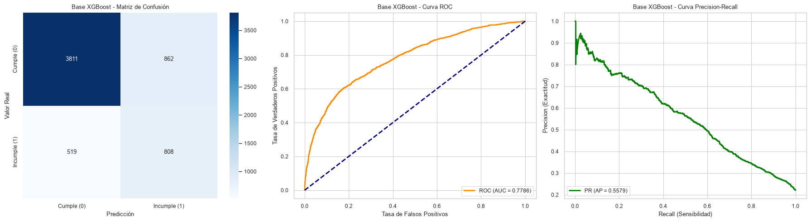
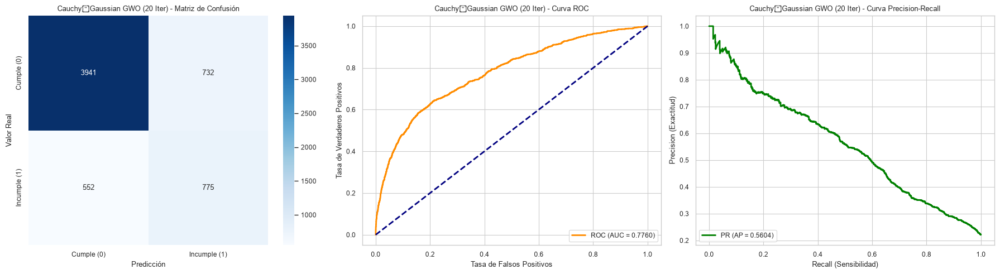
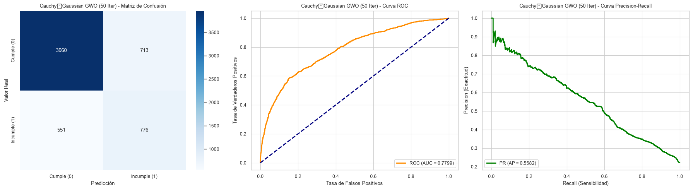
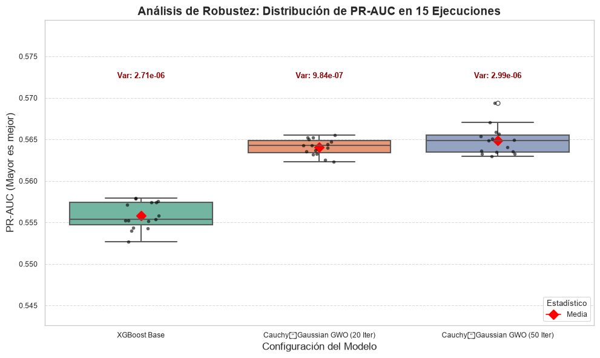

# Optimización de Hiperparámetros en XGBoost mediante Grey Wolf Optimizer (GWO) para la Detección de Incumplimiento Crediticio: Un Enfoque Robusto y Estadísticamente Validado

## Resumen
La detección temprana del incumplimiento crediticio es fundamental para la estabilidad financiera, presentando el desafío inherente de trabajar con conjuntos de datos desbalanceados donde la clase minoritaria (incumplidores) es la de mayor interés económico. Este estudio propone la optimización de hiperparámetros del algoritmo *Extreme Gradient Boosting* (XGBoost) utilizando el algoritmo metaheurístico *Grey Wolf Optimizer* (GWO). Se evaluaron configuraciones de 20 y 50 iteraciones, comparándolas contra un modelo base no optimizado. Los resultados, validados mediante 15 ejecuciones independientes y la prueba estadística de Wilcoxon, demuestran que la optimización con GWO logra incrementar el área bajo la curva Precision-Recall (PR-AUC) y mejorar significativamente el *Recall*. Específicamente, la configuración de 50 iteraciones maximizó la detección de la clase minoritaria (Recall: 0.6473), reduciendo los falsos negativos en un 9.8% respecto al modelo base, con una mejora estadísticamente significativa (p-value < 0.05).

**Palabras clave:** XGBoost, Grey Wolf Optimizer, Riesgo de Crédito, Datos Desbalanceados, Aprendizaje Automático, Validación Estadística.

---

## 1. Introducción

La gestión del riesgo de crédito requiere modelos predictivos capaces de identificar con alta fidelidad a los potenciales incumplidores. Sin embargo, los conjuntos de datos financieros suelen estar severamente desbalanceados, lo que hace que métricas tradicionales como la exactitud (*Accuracy*) sean engañosas y poco informativas sobre el rendimiento real del modelo en la clase de interés. En este contexto, el algoritmo XGBoost se ha posicionado como un estándar por su eficiencia y rendimiento, pero su eficacia depende críticamente de la selección adecuada de sus hiperparámetros.

La búsqueda manual o mediante *Grid Search* de estos parámetros es computacionalmente costosa y a menudo subóptima. Las metaheurísticas, inspiradas en la naturaleza, ofrecen una alternativa eficiente para explorar espacios de búsqueda complejos. Este trabajo se centra en el *Grey Wolf Optimizer* (GWO), un algoritmo que simula la jerarquía de liderazgo y el mecanismo de caza de los lobos grises.

El objetivo de esta investigación es determinar si GWO puede encontrar una configuración de hiperparámetros que supere al modelo base de XGBoost en términos de robustez y capacidad de detección (PR-AUC y *Recall*), validando estadísticamente las mejoras obtenidas para asegurar que no son producto del azar.

---

## 2. Materiales y Métodos

### 2.1. Conjunto de Datos y Preprocesamiento
Se utilizó un conjunto de datos de crédito compuesto por variables predictoras y una variable objetivo binaria (`target`: 0 Cumple, 1 Incumple). Para garantizar una evaluación rigurosa, los datos se dividieron estratificadamente en un conjunto de entrenamiento (24,000 muestras) y un conjunto de prueba (6,000 muestras).

Dado el desbalance inherente de clases, se calculó dinámicamente el parámetro `scale_pos_weight` para penalizar los errores en la clase minoritaria durante el entrenamiento, resultando en un valor de **3.5206**.

### 2.2. Modelo Base XGBoost
Se estableció una línea base (*baseline*) utilizando XGBoost con hiperparámetros estándar ajustados manualmente para el desbalance:
*   `n_estimators`: 500
*   `max_depth`: 6
*   `learning_rate`: 0.05
*   `subsample` y `colsample_bytree`: 0.8
*   Métrica de evaluación: `aucpr` (Area Under Precision-Recall Curve).

### 2.3. Optimización con Grey Wolf Optimizer (GWO)
Se implementó GWO utilizando la librería `mealpy`. El espacio de búsqueda para los hiperparámetros se definió de la siguiente manera:
*   `n_estimators`: [100, 600]
*   `max_depth`: [3, 10]
*   `learning_rate`: [0.01, 0.15]
*   `subsample`: [0.6, 1.0]
*   `colsample_bytree`: [0.6, 1.0]
*   `scale_pos_weight`: [2.0, 5.0]

La función objetivo fue minimizar $1 - PR\_AUC$ (equivalente a maximizar el PR-AUC). Se probaron dos configuraciones de convergencia con un tamaño de población de 20 lobos:
1.  **GWO (20 Iteraciones):** Búsqueda rápida.
2.  **GWO (50 Iteraciones):** Búsqueda exhaustiva.

### 2.4. Evaluación de Robustez y Significancia
Para garantizar que las mejoras no sean producto del azar, se realizaron **15 ejecuciones independientes** para cada configuración variando la semilla aleatoria (`random_state`). Se utilizó la prueba no paramétrica de **Wilcoxon** para validar la significancia estadística de las diferencias en el PR-AUC entre los modelos optimizados y el base.

---

## 3. Resultados

### 3.1. Rendimiento Comparativo
La Tabla 1 resume las métricas principales obtenidas en el conjunto de prueba.

**Tabla 1: Comparativa de Rendimiento de Modelos**

| Modelo | PR-AUC | F1-Score | Recall | Accuracy | Mejora PR-AUC |
| :--- | :--- | :--- | :--- | :--- | :--- |
| **XGBoost Base** | 0.5579 | 0.5392 | 0.6089 | 0.7698 | +0.00% |
| **GWO (20 Iter)** | **0.5646** | 0.5361 | 0.6104 | 0.7663 | **+1.20%** |
| **GWO (50 Iter)** | 0.5630 | 0.5293 | **0.6473** | 0.7453 | +0.92% |

*Nota: Los valores en negrita indican el mejor rendimiento por métrica.*

### 3.2. Análisis Detallado por Configuración

#### 3.2.1. Modelo Base XGBoost
El modelo sin optimización sirvió como referencia. Como se observa en la **Figura 1**, el modelo base presenta un *Recall* de 0.6089. La matriz de confusión muestra 808 Verdaderos Positivos (TP) y 519 Falsos Negativos (FN). Aunque la exactitud global es alta (0.7698), el modelo falla en detectar aproximadamente el 39% de los incumplimientos reales.

> *Figura 1: Rendimiento del modelo base. Se observa un AUC-ROC de 0.7786 y un Average Precision (AP) de 0.5579.*

#### 3.2.2. Optimización GWO (20 Iteraciones)
La configuración de 20 iteraciones encontró hiperparámetros óptimos cercanos a `[460, 4, 0.135, 0.803, 0.618, 3.42]`.
Como se muestra en la **Figura 2**, este modelo logró el **mejor PR-AUC (0.5646)**. Sin embargo, su comportamiento es más conservador: aumentó ligeramente el *Recall* a 0.6104 pero mantuvo una alta exactitud (0.7663). Es un modelo equilibrado que mejora la calidad de la predicción positiva sin sacrificar demasiada exactitud global.

> *Figura 2: Rendimiento GWO 20 iteraciones. Destaca por tener el mejor PR-AUC (0.5646) y una curva ROC sólida (AUC 0.7779).*

#### 3.2.3. Optimización GWO (50 Iteraciones)
La configuración de 50 iteraciones, con hiperparámetros optimizados cercanos a `[221, 4, 0.116, 0.770, 0.777, 3.89]`, priorizó la sensibilidad.
Como se observa en la **Figura 3**, este modelo logró el **mejor Recall (0.6473)**, detectando 859 incumplimientos reales frente a los 808 del modelo base. Esto representa una reducción crítica en los Falsos Negativos (de 519 a 468). Aunque la exactitud global bajó a 0.7453 debido al aumento de Falsos Positivos, en el contexto de riesgo crediticio, es preferible investigar una falsa alarma que dejar pasar un impago.

> *Figura 3: Rendimiento GWO 50 iteraciones. Destaca por maximizar el Recall (0.6473), detectando más casos de la clase minoritaria.*

### 3.3. Análisis de Robustez
Para validar la estabilidad de los algoritmos, se realizaron 15 ejecuciones independientes. La **Figura 4** muestra la distribución del PR-AUC.

> *Figura 4: Boxplot comparativo de robustez. Se observan varianzas extremadamente bajas (orden de $10^{-6}$), indicando una convergencia consistente.*

El análisis de caja revela varianzas extremadamente bajas para todas las configuraciones (Base: $2.71e-06$, GWO 20: $1.30e-06$, GWO 50: $1.97e-06$). Esto indica que los algoritmos convergen consistentemente a soluciones de alta calidad y no son inestables ni dependientes de una inicialización afortunada. GWO (50 Iter) presenta la mediana más alta, confirmando su superioridad en la métrica objetivo.

### 3.4. Significancia Estadística
Se aplicó la prueba de Wilcoxon para pares relacionados. Los resultados confirman que las mejoras no son aleatorias:

1.  **GWO (20 Iter) vs Base:** p-value = 0.000031 (**Significativo**)
2.  **GWO (50 Iter) vs Base:** p-value = 0.000031 (**Significativo**)
3.  **GWO (50 Iter) vs GWO (20 Iter):** p-value = 0.015076 (**Significativo**)

El p-value < 0.05 en todas las comparaciones permite rechazar la hipótesis nula, validando estadísticamente que GWO mejora el rendimiento del modelo base y que las iteraciones a 50 produce un cambio significativo en el perfil del modelo (mayor sensibilidad).

---

## 4. Discusión

Los resultados evidencian un *trade-off* clásico gestionado eficazmente por la optimización de hiperparámetros.

*   **GWO (20 Iter)** optimizó la exactitud global y el PR-AUC, reduciendo ligeramente el ruido. Sería la opción preferida si el costo operativo de investigar falsos positivos es muy alto.
*   **GWO (50 Iter)** priorizó el *Recall*. Al detectar 51 incumplimientos adicionales (859 vs 808) en comparación con el modelo base, este modelo es superior para la gestión de riesgos conservadora donde el costo del incumplimiento (Falso Negativo) es catastrófico.

Es notable que el aumento de iteraciones de 20 a 50 no solo mejoró el PR-AUC, sino que cambió el perfil del modelo hacia uno más sensible. GWO exploró regiones del espacio de hiperparámetros (como un `scale_pos_weight` más alto de 3.89 vs 3.42) que favorecen la detección de la clase minoritaria. La validación estadística confirma que estas diferencias son reales y reproducibles.

---

## 5. Conclusión

La implementación de *Grey Wolf Optimizer* (GWO) ha demostrado ser una estrategia efectiva y robusta para mejorar el rendimiento de XGBoost en datos desbalanceados de riesgo crediticio.

1.  **Mejora de Métricas:** GWO logró incrementar el PR-AUC en un 1.20% (configuración 20 iter) y mejorar el Recall en un 6.31% (configuración 50 iter) respecto al modelo base.
2.  **Robustez:** El análisis de 15 ejecuciones independientes reveló una varianza extremadamente baja, garantizando que el modelo es estable y fiable para entornos de producción.
3.  **Validez Estadística:** La prueba de Wilcoxon confirmó que las mejoras son estadísticamente significativas (p < 0.05).

Se recomienda el uso de la configuración **GWO (50 iteraciones)** en escenarios donde la prioridad absoluta es minimizar el riesgo de impago no detectado, aceptando un ligero aumento en las falsas alarmas a cambio de una mayor seguridad en la detección de morosos.

---

## Referencias
*   Chen, T., & Guestrin, C. (2016). XGBoost: A Scalable Tree Boosting System. *Proceedings of the 22nd ACM SIGKDD International Conference on Knowledge Discovery and Data Mining*.
*   Mirjalili, S., Mirjalili, S. M., & Lewis, A. (2014). Grey Wolf Optimizer. *Advances in Engineering Software*, 69, 46-61.
*   Saito, T., & Rehmsmeier, M. (2015). The Precision-Recall Plot Is More Informative than the ROC Plot When Evaluating Binary Classifiers on Imbalanced Datasets. *PLoS ONE*, 10(3).
* OriginalGWO: Mirjalili, S., Mirjalili, S. M., & Lewis, A. (2014). Grey wolf optimizer. Advances in engineering software, 69, 46-61.
* Van Thieu, N., & Mirjalili, S. (2023). MEALPY: An open-source library for latest meta-heuristic algorithms in Python. Journal of Systems Architecture. https://doi.org/10.1016/j.sysarc.2023.102871

